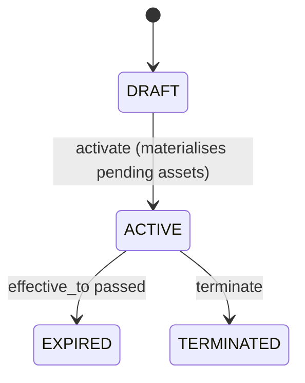

# Phase 2 — Documentation

Goal: turn the rules inventory into a clear, navigable doc set in the **target project** under `docs/business-logic/` (create the dir). Prose language follows the codebase/user's language.

## The doc set (use `templates/`)

Create these files (skip a file only if truly N/A for the scope, and say why in the overview):

| File | Source template | Purpose |
|---|---|---|
| `00-overview.md` | `business-logic-overview.md` | What the system/scope does, actors, high-level capabilities, glossary pointer, scope boundaries. |
| `01-domain-model.md` | `domain-model.md` | Entities, fields, relationships, invariants (`INV-###`), a simple ER/relationship sketch. |
| `02-business-rules.md` | `business-rules.md` | The full rule catalogue (`BR-###`): statement, trigger, outcome, evidence, edge cases. The heart of the docs. |
| `03-workflows.md` | `workflow.md` | State machines & end-to-end flows (`WF-###`): diagrams (Mermaid), transition tables, triggers, guards. |
| `04-interfaces.md` | `interfaces-api.md` | Entrypoints: HTTP/CLI/jobs/events — inputs, outputs, auth, error responses. |
| `05-glossary.md` | `glossary.md` | Domain terms in the project's own language; resolves naming ambiguity. |
| `_rules-inventory.md` | (from Phase 1) | The raw inventory; kept so the matrix and tests stay traceable. Optional to ship. |

## Writing standards

- **Every rule cites evidence** (`path:line`). A reader must be able to jump to the code. This also makes the doc verifiable and refactor-resistant.
- **Use the IDs everywhere.** `BR-014`, `WF-003` — these tie docs ↔ tests ↔ matrix. Never renumber casually.
- **Diagrams for anything stateful.** Prefer Mermaid (`stateDiagram-v2`, `flowchart`, `sequenceDiagram`) so it renders on most git hosts.
- **Tables for transitions, permission matrices, and validation rules** — they're scannable and map 1:1 to test cases later.
- **Mark confidence.** Render `❓ASSUMPTION` items visibly (callout/“Open questions” section) so reviewers can confirm; do not bury them.
- **As-built, not as-wished.** Document quirks. If something looks wrong, document the actual behaviour and add a "Suspected issue" note linking the rule ID — the report aggregates these.
- **Keep it DRY and skimmable.** Overview is a map; details live in the rule catalogue. Cross-link with relative links and IDs.

## Example: a workflow entry

```markdown
### WF-003 — Supply contract activation



| From | To | Trigger | Guard | Side effects | Evidence |
|---|---|---|---|---|---|
| DRAFT | ACTIVE | `PUT .../{id}` status=ACTIVE | — | pending_asset lines → real media units (BR-021) | `...Controller.php:96-101` |

**Open questions:** can a TERMINATED contract be reactivated? No code path found → `❓`.
```

## Checkpoint (guided mode)

Present the doc set for sign-off before building tests. Ask specifically about the `❓ASSUMPTION` items — confirming these now prevents writing tests against guessed behaviour. In `auto` mode, proceed but list unresolved `❓` prominently in the final report.

`docs-only` mode stops here. Otherwise proceed to Phase 3 (`references/03-test-design.md`).
