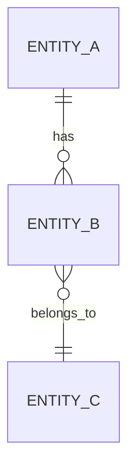

<!-- Output → docs/business-logic/01-domain-model.md -->

# Domain Model: <Scope>

## Entity relationship (sketch)

## Entities

### <EntityName>  ·  table `<table>`  ·  `<path/to/model>`
| Field | Type | Required | Constraints / default | Notes |
|---|---|---|---|---|
| id | <type> | yes | PK | |
| <field> | <type> | <yes/no> | <unique / FK / enum / range / default> | <meaning> |

**Invariants**
- `INV-001` — <e.g. `<field>` is unique within tenant> — *evidence:* `<migration/model path:line>`
- `INV-002` — <…>

**Relationships**
- <EntityName> *has many* <Other> (`<fk>`) — `<path:line>`

<!-- repeat per entity -->

## Enumerations / status sets
| Enum | Values | Used by | Evidence |
|---|---|---|---|
| <StatusEnum> | DRAFT, ACTIVE, … | <entity> | `<path:line>` |
