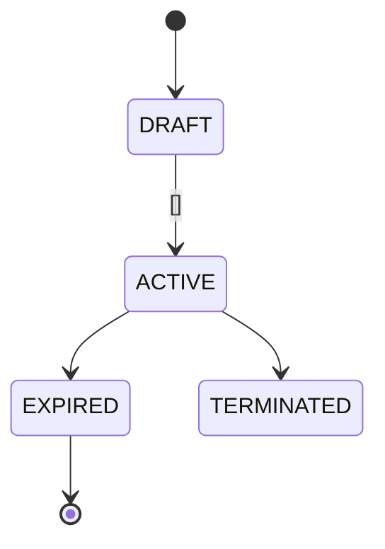

<!-- Output → docs/business-logic/03-workflows.md. One section per workflow/state machine. -->

# Workflows & State Machines: <Scope>

---

### WF-001 — <Workflow name>
**Summary:** <what end-to-end process this is and when it runs.>

**Transition table**
| From | To | Trigger | Guard / precondition | Side effects | Evidence |
|---|---|---|---|---|---|
| DRAFT | ACTIVE | <entrypoint> | <condition> | <events/jobs/data changes> (BR-xxx) | `<path:line>` |
| ACTIVE | EXPIRED | <job/time> | <condition> | <…> | `<path:line>` |

**Disallowed transitions (asserted by tests):** <e.g. TERMINATED → ACTIVE has no code path>

**Related rules:** BR-xxx, INV-xxx
**Open questions:** <if any>

<!-- For non-state-machine flows, use a sequenceDiagram or flowchart instead and keep the step/guard/side-effect/evidence table. -->
