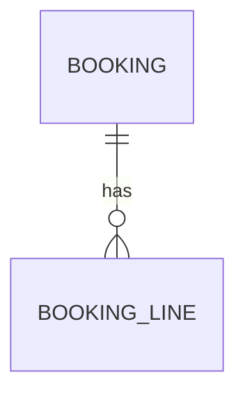

<!-- Output → docs/decomposition.md (or the new project root). The agreed model that drives all scaffolding. -->

# Decomposition — <Requirement title>

> Source: <requirement text / issue link> · Date: <date>

## Goal
<1–2 sentences: what we're building and why.>

## Actors
| Actor | Description | Key capabilities |
|---|---|---|
| <actor> | <…> | <…> |

## Modules (bounded contexts — domain nouns)
| Module | Purpose (1 line) | Owns entities | Targets |
|---|---|---|---|
| `<booking>` | <…> | Booking, BookingLine | BE · Web · App |

## Entities & relationships

Per entity: fields (name: type, required?), invariants (unique/range/enum), relationships — see each module plan.

## Cross-cutting concerns
- Auth / tenant scoping: <reuse existing>
- File storage (MinIO): <which entities store files>
- Audit / events / notifications: <…>

## Open questions (❓ confirm before/while building)
- <…>
